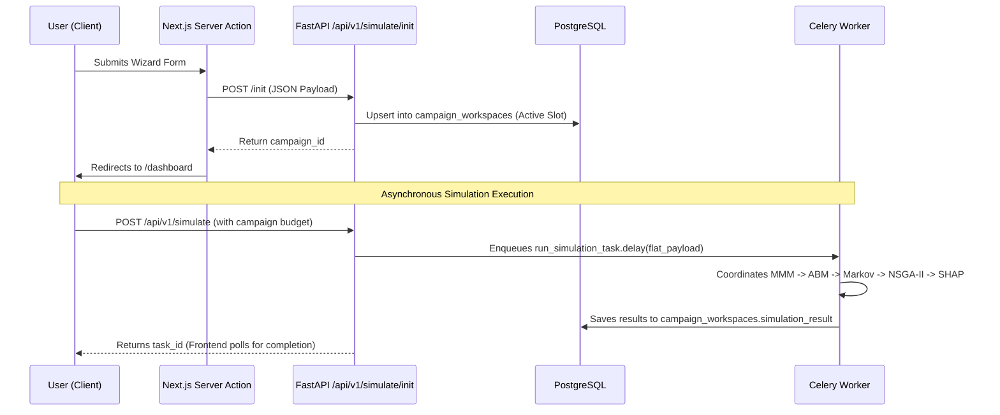

# 🤖 AI Agent & Developer Guide: Brand Simulation Engine

This document serves as the **single source of truth** for AI agents (and developers) working on the **Brand Simulation Engine (PredictionEngine)**. It provides a comprehensive explanation of the project architecture, data flow, technologies, codebase layout, and implementation details, with a focus on helping you hit the ground running without feeling overwhelmed.

---

## 📌 1. Project Overview & Capabilities

The Brand Simulation Engine is a multi-tenant platform designed to model, simulate, and optimize marketing campaigns for Small and Medium Enterprises (SMEs). It bridges high-level macro budget forecasting with granular consumer agent behaviors and real-time competitor intelligence.

### Key Functional Features:
1. **Interactive Dashboard**: Visualizes historical ad performance, active campaign configurations, and ROI metrics.
2. **Simulation Wizard (Onboarding)**: A multi-step form (Ad Metrics, Demographics, Exogenous URLs) that collects initial campaign profiles to spin up user workspaces.
3. **Optimized Analytics**: Provides multi-objective Pareto-optimal budget suggestions (maximizing revenue and ROI simultaneously).
4. **Interactive What-If Simulator**: Allows real-time sliders to adjust channel spend (Meta, Google, TikTok) and immediately observe Hill saturation S-curve forecasts.
5. **AI-Generated Executive Reports**: Generates professional, mathematically-grounded marketing performance summaries in English and Bengali (`bn`) using LLM GraphRAG prompting.

---

## 🚀 2. Technology Stack & Key Libraries

### 💻 Frontend (Next.js & UI)
- **Framework**: Next.js 15 (App Router, dynamic paths locale-aware).
- **Authentication**: Clerk (Multi-tenant JWT session tokens, custom public metadata isolation).
- **Styling**: Tailwind CSS & shadcn/ui components.
- **Charts**: 
  - `lightweight-charts` (Canvas-based rendering for S-curves and ROI credible intervals).
  - `chart.js` (Allocation Donut charts).
  - Custom SVG graphics (for the Markov Funnel Journey graph).
- **Internationalization**: `next-intl` (English and Bengali support with optimized Unicode font subsetting to reduce CLS and load times).
- **LLM Integration**: Vercel AI SDK (`ai` package) streaming to local/cloud providers.

### ⚙️ Backend (Python FastAPI & Workers)
- **Framework**: FastAPI (Pydantic models for request/response contract validation).
- **ORM / Database**: SQLAlchemy (PostgreSQL + TimescaleDB for time-series daily performance tracking).
- **Task Queue**: Celery (using Redis as the message broker) to handle heavy simulation engines asynchronously.
- **Linter & Type Checker**: Ruff + Mypy.
- **ML / Mathematical Engines**:
  - `PyMC-Marketing` (Bayesian Multi-Channel Attribution / Marketing Mix Modeling).
  - `Mesa 3.0` (Agent-Based Modeling for micro consumer agents).
  - `pymoo` (NSGA-II multi-objective genetic optimization).
  - `shap` (TreeExplainer for deterministic feature contributions).
- **NLP / Scraping**:
  - `Firecrawl` + `Crawl4AI` (dual-engine web scraping of competitor websites).
  - `csebuetnlp/banglabert` (Bangla sentiment analysis) + `BAAI/bge-m3` (embeddings).

---

## 🗄️ 3. Data Flow & Workspace Persistence (The DB Source of Truth)

> [!IMPORTANT]
> **Neo4j was fully removed** as a primary database for campaign configurations and has been replaced by the **`campaign_workspaces`** PostgreSQL table. 

### The Workspace System:
- Every campaign is persisted to PostgreSQL in the `campaign_workspaces` table.
- A user can have up to **3 workspaces** (slots 1-3).
- Only **one** workspace is active (`is_active = True`) per user. The dashboard and analytics always load the active workspace.
- The `campaign_workspaces` table uses JSONB columns to store:
  - `campaign_data`: The full input dictionary (budget, channels, audience demographics, target age, cpc, cac, etc.).
  - `simulation_result`: The cached `DashboardResultsResponse` computed by the simulation workers.
  - `competitor_context`: Array of scraped competitor intelligence documents.

### How Onboarding and Simulation Runs Work:

---

## 🧠 4. The 4 Causal Simulation Engines (`engine_runner.py`)

All engines are orchestrated inside [engine_runner.py](file:///E:/Meheraj/PredictionEngine/src/simulation/engine_runner.py):

1. **Bayesian MMM (Macro Simulation)**:
   - Located in [bayesian_mmm.py](file:///E:/Meheraj/PredictionEngine/src/simulation/bayesian_mmm.py).
   - Models **Adstock Transformation** (temporal lag / decay: $A_t = X_t + \lambda A_{t-1}$) and **Hill Saturation Functions** (non-linear S-curves).
   - Returns credible intervals using PyMC prior predictive sampling.
2. **Agent-Based Modeling (Micro Simulation)**:
   - Located in [abm_engine.py](file:///E:/Meheraj/PredictionEngine/src/simulation/abm_engine.py).
   - Generates 1,000 consumer agents possessing demographic attributes (urban millennial, suburban family, rural, etc.) and simulates word-of-mouth diffusion.
3. **Markov Chain Attribution (MTA)**:
   - Located in [markov_attribution.py](file:///E:/Meheraj/PredictionEngine/src/simulation/markov_attribution.py).
   - Generates customer transition journey paths from the ABM outputs.
   - Computes the **Removal Effect** to quantify each channel's marginal conversion contribution.
4. **NSGA-II Genetic Optimization**:
   - Located in [optimization.py](file:///E:/Meheraj/PredictionEngine/src/simulation/optimization.py).
   - Evaluates multi-objective tradeoffs to extract the **Pareto frontier** of optimal budget allocations.

---

## 📁 5. Directory Structure & Key Files

### API Backend (`src/`)
* [src/api/routes/simulate.py](file:///E:/Meheraj/PredictionEngine/src/api/routes/simulate.py) — Handles simulation triggers, onboarding status, and workspace switcher endpoints.
* [src/api/routes/report.py](file:///E:/Meheraj/PredictionEngine/src/api/routes/report.py) — Orchestrates formatting SHAP contributions + PostgreSQL workspace stats for the LLM system prompt.
* [src/api/routes/analytics.py](file:///E:/Meheraj/PredictionEngine/src/api/routes/analytics.py) — Fetches ROI credible interval timelines and Markov funnel transition matrices.
* [src/api/services/campaign_persistence.py](file:///E:/Meheraj/PredictionEngine/src/api/services/campaign_persistence.py) — Primary database driver for managing workspaces, active switches, and saving simulation outputs.
* [src/api/models.py](file:///E:/Meheraj/PredictionEngine/src/api/models.py) — Declarative SQLAlchemy models (RLS compliant).
* [src/api/db/database.py](file:///E:/Meheraj/PredictionEngine/src/api/db/database.py) — SQLAlchemy connection pool and thread-safe `ContextVar` that injects the current tenant context for RLS policies.

### Frontend App (`frontend/`)
* [frontend/src/app/[locale]/dashboard/page.tsx](file:///E:/Meheraj/PredictionEngine/frontend/src/app/[locale]/dashboard/page.tsx) — Main dashboard overview.
* [frontend/src/app/[locale]/onboarding/page.tsx](file:///E:/Meheraj/PredictionEngine/frontend/src/app/[locale]/onboarding/page.tsx) — Simulation Wizard entryway.
* [frontend/src/components/onboarding/SimulationWizard.tsx](file:///E:/Meheraj/PredictionEngine/frontend/src/components/onboarding/SimulationWizard.tsx) — Step-by-step onboarding wizard.
* [frontend/src/app/api/report/route.ts](file:///E:/Meheraj/PredictionEngine/frontend/src/app/api/report/route.ts) — LLM report generator API. It retrieves report context from the Python backend and calls the Vercel AI SDK to stream executive reports.
* [frontend/src/lib/mock-data.ts](file:///E:/Meheraj/PredictionEngine/frontend/src/lib/mock-data.ts) — Contains complete JSON structures for offline fallback mode.

---

## 🔐 6. Multi-Tenant Security & PostgreSQL Row-Level Security (RLS)

- **Authentication**: Clerk resolves user identity and organization context. Requests are intercepted by the FastAPI `ClerkTenantMiddleware` inside [src/api/auth.py](file:///E:/Meheraj/PredictionEngine/src/api/auth.py).
- **SQLAlchemy Event Hook**: In [database.py](file:///E:/Meheraj/PredictionEngine/src/api/db/database.py), a listener bound to `Session.after_begin` automatically executes `SET LOCAL app.current_tenant_id = :tenant_id` at the database level.
- **Row-Level Security**: PostgreSQL enforces policies (`tenant_id = current_setting('app.current_tenant_id')`) ensuring no client can read or modify another tenant's workspace or transaction data.

---

## ⚠️ 7. Critical Gotchas & Coding Rules for AI Agents

1. **NO Neo4j queries in active paths**:
   - The Neo4j client code still exists (`neo4j_client.py`), but it is **fully deprecated and removed** in the active FastAPI backend routes.
   - Do NOT try to connect to Neo4j or write Cypher queries when updating the backend route logic. All campaign/workspace info must be read/written via PostgreSQL models.
   - *Note:* The Next.js frontend has a legacy fallback in `retriever.ts` that hits Neo4j directly ONLY if the Python backend is unreachable. Do not try to replicate or build upon this in the python backend.
2. **NO in-memory dictionary lookups**:
   - The volatile `_user_campaigns` dictionary is removed.
   - To look up a campaign, import `get_workspace_by_campaign_id(campaign_id)` from `src.api.services.campaign_persistence` to read it from the database.
3. **Use the correct Virtual Environment (`venv`)**:
   - The workspace contains a standard Python virtualenv named `venv`, **not `.venv`**.
   - Path to Python: `.\venv\Scripts\python.exe`
   - Path to pip: `.\venv\Scripts\pip.exe`
4. **Local Lint & Type Verification**:
   - Always run lint and type checks before declaring a task complete:
     - **Mypy**: `.\venv\Scripts\mypy.exe src/ --ignore-missing-imports`
     - **Ruff**: `.\venv\Scripts\ruff.exe check .`
5. **Mock Mode Fallback**:
   - If the frontend is configured with `NEXT_PUBLIC_USE_MOCK_DATA="true"`, or if the Python backend is down (`ECONNREFUSED` or `503`), the Next.js frontend will gracefully degrade and load high-fidelity mockup data from `frontend/src/lib/mock-data.ts`. Keep this in mind when debugging frontend connectivity issues.

---

## 📚 8. Key Marketing Jargon & Mathematical Glossary

As an AI agent or developer working on the simulation engine, it is crucial to understand the domain-specific marketing terms and their mathematical representations:

### 1. iROAS (Incremental Return on Ad Spend)
- **Concept:** Measures the *causal* revenue generated by ad spend, excluding baseline organic sales. Traditional ROAS overestimates ad effectiveness by including organic conversions.
- **Formula:** 
  $$\text{iROAS} = \frac{\text{Incremental Sales}}{\text{Ad Spend}}$$

### 2. mROI (Marginal Return on Investment)
- **Concept:** Represents the return expected from the next incremental dollar spent. Used to locate the optimal budget scaling threshold before saturation.
- **Formula:**
  $$\text{mROI} = \frac{\Delta \text{Revenue}}{\Delta \text{Ad Spend}}$$

### 3. Adstock (Carryover / Memory Effect)
- **Concept:** Models how advertising awareness decays over time. The memory retention rate ($\lambda$) determines the speed of decay.
- **Formula:**
  $$A_t = X_t + \lambda A_{t-1}$$

### 4. Hill Saturation Function
- **Concept:** Models diminishing returns as spend increases, converting Adstock values into saturated returns.
- **Formula:**
  $$f(x) = \frac{x^S}{K^S + x^S}$$

### 5. Markov Chain MTA & Removal Effect
- **Concept:** Models the customer buying journey as states in a probability matrix. The *Removal Effect* measures the percentage of conversions lost when a specific marketing channel (node) is completely removed.
- **Implementation:** Located in `markov_attribution.py`.

### 6. CAC (Customer Acquisition Cost)
- **Concept:** Average cost to acquire a single customer.
- **Formula:**
  $$\text{CAC} = \frac{\text{Total Spend}}{\text{Total Customers Acquired}}$$
