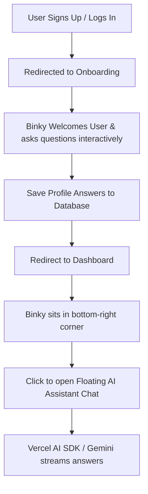

# Black Bunny AI Companion Integration Guide

This guide provides the necessary AI image prompts, architectural steps, and specific IDE Agent prompts to implement a cute black bunny companion named **Binky** (or any name you choose) that guides users through onboarding and serves as an interactive chat assistant afterwards.

---

## 🐰 Bunny Companion Image Asset

Here is the custom 3D companion asset generated for you to use in the application layout:


---

## 🎨 AI Prompts for Creating Bunny Assets

Depending on the image generator you use (Midjourney, DALL-E 3, Stable Diffusion, or Figma/Spline), use these curated prompts to get consistent poses and transparent backgrounds.

### 1. Midjourney / DALL-E 3 Prompts (for static UI assets)

> [!TIP]
> Use these prompts to generate standard states (Idle, Happy/Success, Thinking, Confused/Error). Always request a plain white background so it can be easily removed or set to transparent.

*   **Idle / Welcoming State:**
    > `/imagine prompt: A cute, chubby, chibi-style 3D black bunny character, sitting upright with a friendly, welcoming expression. Soft black matte fur, large shiny dark violet-tinted eyes, pink inner ears, and a tiny nose. Minimalist design, high-quality Blender render, Pixar style, soft ambient lighting, clean solid white background, high resolution --ar 1:1 --v 6.0`
*   **Thinking State (for when loading answers):**
    > `/imagine prompt: A cute chibi-style 3D black bunny character looking up thoughtfully with one paw touching its chin. Soft black fur, large shiny dark eyes, inquisitive expression. Pixar style, soft ambient lighting, clean solid white background, high resolution --ar 1:1 --v 6.0`
*   **Success / Celebration State (for completing onboarding steps):**
    > `/imagine prompt: A cute chibi-style 3D black bunny character jumping with joy, happy smiling expression, paws raised. Soft black fur, sparkles around it, Pixar style, soft ambient lighting, clean solid white background, high resolution --ar 1:1 --v 6.0`
*   **Error / Confused State (for validation failures):**
    > `/imagine prompt: A cute chibi-style 3D black bunny character looking slightly confused or dizzy with ears drooped. Soft black fur, cartoonish questioning look, Pixar style, soft ambient lighting, clean solid white background, high resolution --ar 1:1 --v 6.0`

### 2. SVG Vector Prompt (For scalable, lightweight, flat-design UI)
*   **Vector Illustration:**
    > `A flat vector graphic of a cute minimalist black bunny character, modern design, big expressive circular eyes, soft curves, black and pastel pink colors, transparent background, SVG style, web graphic --no gradients shading`

---

## 🛠️ Step-by-Step Implementation Steps

We will implement this companion using the existing stack of your application:
- **Frontend**: Next.js 16 (App Router), `framer-motion` for animations, TailwindCSS for styling, `@clerk/nextjs` for user auth.
- **AI Engine**: Vercel AI SDK (`ai` and `@ai-sdk/google`) to stream responses using Gemini.
- **Backend (Optional/Alternative)**: FastAPI endpoint if you want the bunny to access Neo4j/Weaviate simulation data.



### Phase 1: Interactive Onboarding Component
1. Create a `BunnyCompanion` UI component that handles animations (`framer-motion`) and displays custom messages/speech bubbles.
2. Embed the bunny inside a customized onboarding form or replace `SimulationWizard` to make it a conversational dialog:
   - *Question 1*: "Hi! I'm Binky. What should I call you?"
   - *Question 2*: "Awesome! What is your primary industry or simulation target?"
   - *Question 3*: "Got it! How experienced are you with simulation modeling?"
3. Submit these onboarding responses to your FastAPI backend or database, then flag the user as onboarded.

### Phase 2: Floating Assistant Widget
1. Create a `FloatingBunnyWidget` that stays in the bottom right corner of the dashboard pages.
2. When hovered, the bunny performs a micro-animation (e.g., ear wiggle, floating hover).
3. When clicked, it opens a chat panel where users can ask questions.

### Phase 3: AI Chat Integration
1. Implement a Next.js API Route `/api/chat` using Vercel AI SDK and `@ai-sdk/google`.
2. Give the AI model a system prompt to roleplay as **Binky**, the cute, highly helpful black bunny companion.

---

## 🤖 Prompts to Implement this Using the IDE Agent

You can copy and run these prompts one-by-one with your IDE Agent (like Antigravity) to build the feature.

### Prompt 1: Create the Base Bunny Component
Copy this prompt and send it to the agent to build the visual presentation layer:
```text
I want to create a reusable component for my black bunny companion.
1. Create a component `@/components/companion/BunnyCompanion.tsx` that displays the bunny image and a sleek, animated speech bubble (using framer-motion).
2. The component should accept `state` ('idle' | 'thinking' | 'happy' | 'confused') and a `speech` string.
3. The speech bubble should appear with a scale-in transition and text typing animation.
4. Place the generated bunny asset (file:///C:/Users/PC8/.gemini/antigravity-ide/brain/ac1324eb-5d56-4190-b250-ac45af6a41b5/black_bunny_companion_1781033629673.png) in the public directory at `/assets/bunny/idle.png` so the component can access it.
```

### Prompt 2: Replace Onboarding with Conversational Onboarding
Copy this prompt to build the interactive onboarding questionnaire:
```text
I want to use our new BunnyCompanion component in the onboarding flow.
1. Modify or wrap the onboarding wizard in `@/app/[locale]/onboarding/page.tsx` or `@/components/onboarding/SimulationWizard.tsx` to integrate the conversational bunny companion.
2. The bunny should walk the user through 3 interactive questions: Name/Nickname, Target Goal, and Experience Level.
3. Use smooth state transitions as the user answers. Make the bunny do a "happy" animation upon successful step completion.
4. Once completed, save these options using the existing backend action or endpoint and redirect the user to the dashboard.
```

### Prompt 3: Add Floating Dashboard Widget
Copy this prompt to place the bunny in the corner of the dashboard:
```text
I want to add the bunny companion to the dashboard.
1. Create a floating widget `@/components/companion/FloatingBunny.tsx` that rests in the bottom-right corner of the layout (excluding onboarding/auth pages).
2. Use framer-motion to make the bunny float gently up and down (idle animation).
3. Clicking on the bunny should slide open a sleek glassmorphic chat sheet (drawer or popup window) containing a chat interface.
4. Integrate the floating widget into the root layout so it is available across the dashboard.
```

### Prompt 4: Integrate AI Chat streaming
Copy this prompt to implement the backend Gemini API and Vercel AI SDK logic:
```text
I want to make the bunny answer questions using Gemini.
1. Set up a Next.js API route `/api/chat` that uses the Vercel AI SDK (`ai` and `@ai-sdk/google`) to stream responses using a Gemini model.
2. Add a system prompt specifying that the AI is "Binky, a helpful, cheerful, and cute black bunny companion who loves simulations. Binky should use occasionally cute emojis (🐰, ✨, 🥕) and speak in a friendly, enthusiastic, yet professional tone about simulation topics."
3. Wire the chatbot UI in `FloatingBunny.tsx` to the API route using the `useChat` hook from `@ai-sdk/react`.
```
