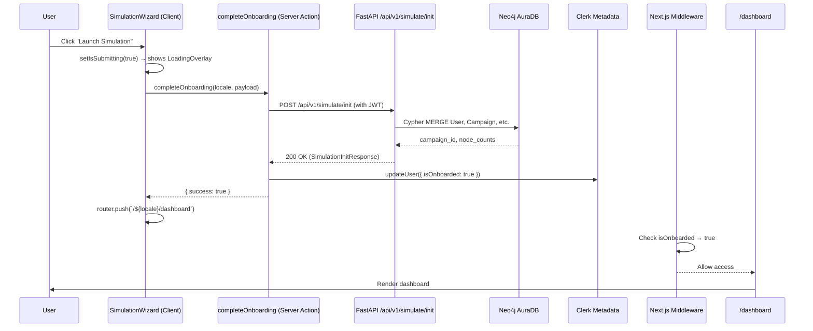

# 🔍 Onboarding Bug Diagnosis: "Loading Neo4j knowledge graph…" Stuck Screen

## Symptom
After sign-up → filling in all 3 onboarding steps (Ad Metrics, Demographics, Market Intel) → clicking **Launch Simulation**, the app displays a `LoadingOverlay` with the message "Loading Neo4j knowledge graph…" and **never transitions to the dashboard**.

## How The Flow Should Work



The loading overlay stays visible because `isSubmitting` is set to `true` and **never gets set back to `false`** on the success path — instead, `router.push()` is supposed to navigate away. If navigation doesn't happen, the overlay stays forever.

---

## 🎯 All Possible Root Causes (Ranked by Likelihood)

### Category 1: Frontend → Backend Schema Mismatch (🔴 MOST LIKELY)

> [!CAUTION]
> This is the **#1 suspect**. The frontend sends a `SimulationRequest` shape but the backend `/init` endpoint expects `SimulationInitRequest` — and the `ExogenousMatrix` has `extra="forbid"`.

#### 1A. `ExogenousMatrix` rejects the frontend payload with HTTP 422

- **File**: [simulate.py:L337-L342](file:///e:/blockchain/Prediction-Engine/src/api/routes/simulate.py#L337-L342) — the `/init` endpoint uses `SimulationInitRequest`
- **File**: [simulation.py:L55-L71](file:///e:/blockchain/Prediction-Engine/src/schemas/simulation.py#L55-L71) — `ExogenousMatrix` has `extra="forbid"`
- **The mismatch**: The frontend's `SimulationRequest` type (in [contracts.ts:L70-L91](file:///e:/blockchain/Prediction-Engine/frontend/src/lib/types/contracts.ts#L70-L91)) sends `exogenous: { competitor_urls: ["..."] }` — but the backend's `ExogenousMatrix` expects `competitor_urls` as `list[HttpUrl]` **AND** it also expects `competitors` and `macroeconomic_flags` (which have defaults). However, `extra="forbid"` means if the frontend sends any unexpected field, it returns 422.
- **Additionally**: The frontend sends raw URL strings but the backend expects Pydantic `HttpUrl` objects. Malformed URLs would cause validation failure.

#### 1B. The `SimulationInitRequest` has `extra="forbid"` — any extra field kills it

- If the frontend's payload shape doesn't exactly match (e.g., sends fields not in the schema), the request fails with HTTP 422 before any handler code runs.
- **Key difference**: Frontend `SimulationRequest` (TypeScript) sends `audience: { age, gender, interest }` but backend `SimulationInitRequest` requires `AudienceMatrix` which only accepts `age`, `gender`, `interest` — this should be fine.
- **But**: Frontend sends `endogenous.spend_meta`, `spend_google`, `spend_tiktok` → backend `EndogenousMatrix` has `extra="ignore"` so extra fields are silently dropped — this is safe.

#### 1C. Age range mismatch between frontend and backend

- **Frontend** [simulation.ts:L3](file:///e:/blockchain/Prediction-Engine/frontend/src/schemas/simulation.ts#L3): `AGE_RANGES = ["18-24", "25-29", "30-34", "35-39", "40-44", "45-49", "50+"]`
- **Backend** [simulation.py:L10](file:///e:/blockchain/Prediction-Engine/src/schemas/simulation.py#L10): `AgeRange = Literal["18-24", "25-34", "35-44", "45-54", "55+"]`
- The backend uses `age: str` (not `AgeRange` literal) in `AudienceMatrix`, so this won't cause a validation error, but the data will be inconsistent.

---

### Category 2: Backend Returns Non-OK but `completeOnboarding` Proceeds → Clerk Metadata Update Fails Silently

#### 2A. Backend returns HTTP 422/500 → falls through to error branch

- In [onboarding.ts:L63-L77](file:///e:/blockchain/Prediction-Engine/frontend/src/actions/onboarding.ts#L63-L77): if `response.status` is NOT `ok` and NOT `503`, the action returns `{ success: false, error: "..." }`.
- In [SimulationWizard.tsx:L238-L241](file:///e:/blockchain/Prediction-Engine/frontend/src/components/onboarding/SimulationWizard.tsx#L238-L241): the wizard sets `submitError` and `setIsSubmitting(false)` — this should show an error message.
- **BUT**: If the server action itself throws (uncaught), the catch block on [L242-L246](file:///e:/blockchain/Prediction-Engine/frontend/src/components/onboarding/SimulationWizard.tsx#L242-L246) fires and also sets `isSubmitting(false)`.
- **So this path should NOT cause a stuck screen** — it would show an error. Unless the error is happening silently inside the server action.

#### 2B. Server action returns `{ success: true }` but `router.push()` fails silently

- [onboarding.ts:L111-L118](file:///e:/blockchain/Prediction-Engine/frontend/src/actions/onboarding.ts#L111-L118): The action returns `{ success: true }` even when `graphWriteSucceeded = false` (network error/timeout is treated as non-fatal).
- In this case, `router.push("/en/dashboard")` is called on [SimulationWizard.tsx:L237](file:///e:/blockchain/Prediction-Engine/frontend/src/components/onboarding/SimulationWizard.tsx#L237).
- **BUT**: `isSubmitting` is never set to `false` on the success path — the component relies on navigation happening to unmount the loading overlay.
- If `router.push()` navigates to `/dashboard` and the **middleware** checks `isOnboarded` but it's NOT yet `true` in Clerk's session claims, the middleware **redirects back to `/onboarding`** → infinite redirect loop (or the page reloads showing the same onboarding with the overlay already gone because the component remounts).

---

### Category 3: Clerk Session Claims Stale After Metadata Update (🟡 VERY LIKELY)

> [!WARNING]
> This is the **#2 suspect**. Even if onboarding succeeds, the session token may not reflect the new `isOnboarded: true` metadata.

#### 3A. Clerk `publicMetadata` not propagated to active session

- [onboarding.ts:L101-L109](file:///e:/blockchain/Prediction-Engine/frontend/src/actions/onboarding.ts#L101-L109): After persisting to Neo4j, the server action updates Clerk metadata: `publicMetadata: { isOnboarded: true }`.
- **BUT**: Clerk's JWT session token is issued at login time. Updating `publicMetadata` server-side does NOT automatically update the active session's `sessionClaims`.
- When `router.push("/en/dashboard")` fires, the [middleware](file:///e:/blockchain/Prediction-Engine/frontend/src/middleware.ts#L89-L122) runs `resolveOnboarded()` which first checks `isOnboardedFromClaims(sessionClaims)` — this returns `false` because the session claims are stale.
- The middleware then calls `fetchOnboardingStatus(userId)` which hits the backend `/api/v1/simulate/status/{userId}`.
- If that succeeds and returns `is_onboarded: true`, `has_campaign: true`, the middleware allows access.
- **But if the backend is slow, the /status endpoint fails, or Neo4j is down**, it falls back to mock data where `is_onboarded: false` ([mock-data.ts:L115-L119](file:///e:/blockchain/Prediction-Engine/frontend/src/lib/mock-data.ts#L115-L119)) → **middleware redirects back to `/onboarding`** → infinite loop!

#### 3B. `fetchOnboardingStatus` fallback returns `is_onboarded: false`

- [onboarding.ts (lib):L52-L64](file:///e:/blockchain/Prediction-Engine/frontend/src/lib/onboarding.ts#L52-L64): When the backend response is not OK OR the fetch throws an error, it falls back to `MOCK_ONBOARDING_STATUS` which has `is_onboarded: false`.
- This means: if `/simulate/status/{userId}` fails for ANY reason (timeout, network error, Neo4j down), the middleware thinks the user is NOT onboarded and redirects them to `/onboarding`.
- On the onboarding page, [onboarding/page.tsx:L21-L28](file:///e:/blockchain/Prediction-Engine/frontend/src/app/%5Blocale%5D/onboarding/page.tsx#L21-L28) calls `resolveIsOnboarded()` which also checks the backend → also fails → shows the wizard again (but the `isSubmitting` state is reset because the component remounted).

---

### Category 4: Railway Cold Start / Network Timeout

#### 4A. Railway backend sleeping → 55s timeout reached

- [onboarding.ts:L46-L61](file:///e:/blockchain/Prediction-Engine/frontend/src/actions/onboarding.ts#L46-L61): The request has a 55s timeout. Railway free tier cold-starts can take 15-30s. If Neo4j AuraDB ALSO has a cold-start, the combined latency could exceed 55s.
- The warm-up ping on [L34-L44](file:///e:/blockchain/Prediction-Engine/frontend/src/actions/onboarding.ts#L34-L44) helps but has a 5s timeout — if Railway takes 15s to wake, the warm-up fails, and the main request still needs to wait for cold-start.
- **When timeout hits**: The abort fires, the catch on [L79-L93](file:///e:/blockchain/Prediction-Engine/frontend/src/actions/onboarding.ts#L79-L93) catches it, logs a warning, and **proceeds anyway** returning `{ success: true }`.
- This means the wizard tries to navigate to dashboard, but Neo4j never actually got written to → middleware's `/status` check fails → redirect loop.

#### 4B. Vercel serverless function timeout (Edge vs Node)

- Vercel Serverless Functions (Node.js) on the free tier have a **10-second** timeout, not 60s. The server action `completeOnboarding` runs as a Vercel serverless function.
- If the backend takes >10s to respond, Vercel kills the function → the client receives a 504 → the catch block fires → `setSubmitError("Connection error. Please try again.")` → user sees error (NOT stuck).
- **However**: On Vercel Pro, the limit is 60s. If you're on Pro and the backend takes 11-55s, it would succeed but with stale data.

---

### Category 5: Neo4j AuraDB Connectivity Issues

#### 5A. Neo4j AuraDB instance paused/sleeping

- Free-tier Neo4j AuraDB instances auto-pause after 3 days of inactivity. When paused, the `/init` endpoint gets `ServiceUnavailable` → returns HTTP 503.
- [onboarding.ts:L65-L70](file:///e:/blockchain/Prediction-Engine/frontend/src/actions/onboarding.ts#L65-L70): 503 is treated as non-fatal → `graphWriteSucceeded = false` → onboarding proceeds without graph data.
- User navigates to dashboard → middleware checks `/status` → Neo4j still down → falls back to mock `is_onboarded: false` → redirect to onboarding → **stuck loop**.

#### 5B. Neo4j credentials expired or rotated

- If `NEO4J_URI`, `NEO4J_USERNAME`, or `NEO4J_PASSWORD` in Doppler/Railway are wrong, the driver can't connect → `ServiceUnavailable` on every attempt.

---

### Category 6: Client-Side Navigation / Middleware Issues

#### 6A. `router.push()` soft navigation blocked by middleware redirect

- Next.js `router.push()` triggers a soft navigation. If the middleware intercepts the `/dashboard` request and redirects to `/onboarding`, the client stays on the same page — but the `isSubmitting` state is NOT reset because the component didn't remount (soft navigation back to the same page doesn't unmount).
- **This is the actual mechanism that causes the "stuck" overlay**: The overlay stays because `isSubmitting = true`, and the redirect happens silently behind the scenes.

#### 6B. Dashboard page itself redirects back to onboarding

- [dashboard/page.tsx:L35-L37](file:///e:/blockchain/Prediction-Engine/frontend/src/app/%5Blocale%5D/dashboard/page.tsx#L35-L37): If `results.status === "no_campaign"`, the dashboard page calls `redirect("/en/onboarding")`.
- This means even if the middleware allows access, the dashboard page checks for campaign data. If the backend `/simulate/results/{userId}` returns `no_campaign` (because Neo4j write failed or is slow), the dashboard redirects back to onboarding.

---

## 🔎 Debugging Prompts (Copy-Paste for AI Assistants)

### Prompt 1: Verify Backend Schema Compatibility
```
I have a Next.js frontend sending a POST to a FastAPI backend at /api/v1/simulate/init. 
The frontend sends this payload shape:

{
  "clerk_user_id": "user_xxx",
  "endogenous": { "Impressions": 100000, "Clicks": 5000, "spend_meta": 75000, "spend_google": 50000, "spend_tiktok": 25000 },
  "transactional": { "Total_Conversion": 250, "revenue": 500000 },
  "audience": { "age": "25-29", "gender": "M", "interest": "Travel" },
  "exogenous": { "competitor_urls": ["https://www.daraz.com.bd", "https://www.chaldal.com"] }
}

The backend expects `SimulationInitRequest` which has `extra="forbid"` and contains 
`ExogenousMatrix` which also has `extra="forbid"` with these fields:
- competitors: list[str] (default: ["Category Benchmark A", "Category Benchmark B"])
- competitor_urls: list[HttpUrl]
- macroeconomic_flags: list[str] (default: ["baseline_market_conditions"])

The frontend only sends `competitor_urls` inside `exogenous`. Will the `extra="forbid"` 
on ExogenousMatrix reject this? Or will the defaults for `competitors` and 
`macroeconomic_flags` populate automatically despite `extra="forbid"`?

Also, the frontend sends `exogenous` as optional (spread with `...` syntax). If the user 
provides no competitor URLs, the frontend omits the `exogenous` key entirely. The backend 
has `exogenous: ExogenousMatrix = Field(default_factory=ExogenousMatrix)` — will this 
work correctly when the key is missing?
```

### Prompt 2: Diagnose the Redirect Loop
```
I have a Next.js 15 app with Clerk auth and a middleware that checks onboarding status 
before allowing access to /dashboard. After completing onboarding:

1. Server action calls `clerkClient().users.updateUser(userId, { publicMetadata: { isOnboarded: true } })`
2. Server action returns { success: true }
3. Client calls `router.push("/${locale}/dashboard")`
4. Middleware intercepts, checks `sessionClaims.publicMetadata.isOnboarded` — this is STALE (still false)
5. Middleware falls back to fetching `/api/v1/simulate/status/{userId}` from Railway backend
6. If Railway is slow or Neo4j is down, it falls back to mock data with `is_onboarded: false`
7. Middleware redirects back to `/onboarding`
8. The LoadingOverlay stays visible because `isSubmitting` never gets set to `false`

How do I fix this? Options I'm considering:
A) Force a session refresh after updating Clerk metadata (e.g., `await clerk.sessions.getSession()`)
B) Skip the middleware check for the initial redirect after onboarding (e.g., pass a query param)
C) Set `isSubmitting(false)` and handle the redirect loop gracefully on the client
D) Use `window.location.href` instead of `router.push()` to force a full page reload
```

### Prompt 3: Fix the Railway/Neo4j Timeout Chain
```
My backend is on Railway (Python FastAPI) and uses Neo4j AuraDB (free tier). 
The onboarding flow has this problem:

1. Frontend server action (Vercel) POSTs to Railway backend /api/v1/simulate/init
2. Railway may be sleeping (cold start 15-30s)
3. Neo4j AuraDB may also be paused (free tier pauses after 3 days of inactivity)
4. The combined cold-start can exceed the 55s timeout
5. When it times out, the code proceeds with onboarding anyway (graphWriteSucceeded=false)
6. But then the middleware checks /api/v1/simulate/status/{userId} → Neo4j has no data → redirects to onboarding

How should I handle this cascade failure? I need the user to always land on the dashboard 
after onboarding, even if Neo4j/Railway is temporarily unavailable. The mock data fallback 
currently returns is_onboarded=false which causes the redirect loop.
```

### Prompt 4: Fix the Client-Side Stuck State
```
In my SimulationWizard component, when the form submits successfully:

1. `setIsSubmitting(true)` is called, showing a LoadingOverlay
2. Server action returns `{ success: true }`
3. `router.push("/${locale}/dashboard")` is called
4. `isSubmitting` is NEVER set back to false on the success path

If the navigation fails (middleware redirect, network error, etc.), the LoadingOverlay 
stays forever because the component doesn't unmount and isSubmitting stays true.

How do I make this resilient? I need to:
- Detect if navigation actually succeeded
- Set a timeout fallback to reset the loading state
- Handle the case where middleware redirects back to the same page
```

### Prompt 5: Verify the MOCK_ONBOARDING_STATUS Fallback Logic
```
In my middleware and onboarding library, when the backend /simulate/status endpoint is 
unreachable, the code falls back to:

MOCK_ONBOARDING_STATUS = { is_onboarded: false, has_campaign: false }

This is wrong because:
- In the middleware's protected route check, `onboarded = false` → redirects to /onboarding
- But the user just completed onboarding — they should be marked as onboarded

The fix should:
1. Never fall back to `is_onboarded: false` for users who just completed onboarding
2. Use Clerk's publicMetadata as the authoritative source when the backend is unreachable
3. Only redirect to onboarding when we're CERTAIN the user hasn't onboarded

Review my middleware logic and suggest the minimal, safe fix.
```

---

## 🛠️ Manual Verification Steps

### Step 1: Check Railway Logs for HTTP 422 Errors
1. Go to your **Railway project dashboard**
2. Open the **FastAPI service** → **Deployments** → **Logs**
3. Search for `simulate/init` and look for:
   - `422 Unprocessable Entity` (schema validation failure)
   - `503 Service Unavailable` (Neo4j down)
   - `500 Internal Server Error` (unexpected crash)
4. Look for the Pydantic validation error detail — it will tell you exactly which field failed

### Step 2: Check Neo4j AuraDB Status
1. Go to [Neo4j AuraDB Console](https://console.neo4j.io/)
2. Check if your instance is **Running** or **Paused**
3. If paused, **resume it** and wait 2-3 minutes
4. Run this Cypher query to check if any User nodes exist:
   ```cypher
   MATCH (u:User) RETURN u.clerk_id, u.is_onboarded LIMIT 10
   ```

### Step 3: Check Clerk Metadata
1. Go to [Clerk Dashboard](https://dashboard.clerk.com/) → **Users**
2. Find your test user
3. Check **Public Metadata** — is `isOnboarded` set to `true`?
4. If not, the `clerkClient().users.updateUser()` call failed

### Step 4: Test the Backend Endpoint Directly
```bash
# 1. Get a Clerk session token from browser DevTools:
#    Application tab → Cookies → find `__session` cookie value

# 2. Hit the /init endpoint directly:
curl -X POST "https://YOUR-RAILWAY-URL/api/v1/simulate/init" \
  -H "Content-Type: application/json" \
  -H "Authorization: Bearer YOUR_CLERK_JWT" \
  -d '{
    "clerk_user_id": "user_YOUR_ID",
    "endogenous": {"Impressions": 100000, "Clicks": 5000, "spend_meta": 75000, "spend_google": 50000, "spend_tiktok": 25000},
    "transactional": {"Total_Conversion": 250, "revenue": 500000},
    "audience": {"age": "25-29", "gender": "M", "interest": "Travel"},
    "exogenous": {"competitor_urls": ["https://www.daraz.com.bd"]}
  }'

# 3. Check the status endpoint:
curl "https://YOUR-RAILWAY-URL/api/v1/simulate/status/user_YOUR_ID"

# 4. Check the health endpoint:
curl "https://YOUR-RAILWAY-URL/health"
```

### Step 5: Check Vercel Function Logs
1. Go to **Vercel Dashboard** → your project → **Logs**
2. Filter by `completeOnboarding`
3. Look for:
   - `[completeOnboarding] Backend fetch failed:` — network/timeout error
   - `[completeOnboarding] Backend returned HTTP 422:` — schema mismatch
   - `[completeOnboarding] Graph DB unavailable (503)` — Neo4j down
   - `[completeOnboarding] Clerk metadata update failed:` — Clerk API error

### Step 6: Check Doppler Environment Variables
1. Go to **Doppler Dashboard**
2. Verify these variables are set correctly for the **production** environment:
   - `NEXT_PUBLIC_API_URL` — must point to your Railway backend URL (e.g., `https://your-app.up.railway.app`)
   - `NEO4J_URI` — must be the AuraDB bolt URI
   - `NEO4J_USERNAME` / `NEO4J_PASSWORD` — must match AuraDB credentials
   - `CLERK_SECRET_KEY` — must be valid
   - `CLERK_JWKS_URL` — must match your Clerk domain
   - `FRONTEND_URL` — must match your Vercel deployment URL (for CORS)

### Step 7: Check Browser DevTools
1. Open the onboarding page
2. Open DevTools → **Console** tab
3. Fill in the form and click "Launch Simulation"
4. Look for:
   - `[SimulationWizard] Calling completeOnboarding server action...` — form submitted
   - `[SimulationWizard] Server action returned: { success: true }` — action succeeded
   - `[SimulationWizard] Success! Navigating to dashboard...` — navigation attempted
   - Any errors after this point — middleware redirect, 404, etc.
5. Check the **Network** tab for any redirect chains (301/307 responses)

---

## 📊 Root Cause Probability Assessment

| # | Root Cause | Probability | Why |
|---|-----------|-------------|-----|
| 1 | Middleware redirect loop (stale Clerk claims + mock fallback returning `is_onboarded: false`) | **40%** | Most common pattern with Clerk + middleware guards |
| 2 | Neo4j AuraDB paused/unavailable → `/init` returns 503 → data never persisted → `/status` returns no data | **25%** | Free tier auto-pauses after 3 days |
| 3 | Railway cold-start timeout → onboarding proceeds without graph data → dashboard has no campaign | **15%** | 55s timeout vs. Railway + Neo4j double cold-start |
| 4 | ExogenousMatrix `extra="forbid"` rejecting the frontend payload (HTTP 422) | **10%** | Only if Pydantic treats missing-with-defaults differently under `extra="forbid"` |
| 5 | `NEXT_PUBLIC_API_URL` misconfigured in Vercel → requests go to localhost:8000 | **5%** | Would fail immediately with connection refused |
| 6 | Clerk metadata update fails silently + session claims never update | **5%** | Clerk API is generally reliable |

> [!IMPORTANT]
> The **most likely scenario** is a combination of **#1 + #2**: Neo4j is down or slow, the onboarding "succeeds" without writing data, Clerk metadata gets updated, but when the middleware checks `/status`, Neo4j still has no campaign data → falls back to mock `is_onboarded: false` → redirects back to onboarding → the loading overlay stays because `isSubmitting` was never reset on the success path.

---

## ⚡ Quick Wins (Things to Try Right Now)

1. **Check if Neo4j AuraDB is paused** — resume it if so
2. **Check Railway logs** — look for 422 or 503 on `/simulate/init`
3. **Check Vercel logs** — look for `[completeOnboarding]` messages
4. **Manually hit `/health`** on your Railway backend — if Neo4j reports `error`, that's your problem
5. **Set `NEXT_PUBLIC_USE_MOCK_DATA=true`** in Vercel temporarily — if the app works in mock mode, the issue is definitely backend/Neo4j connectivity
