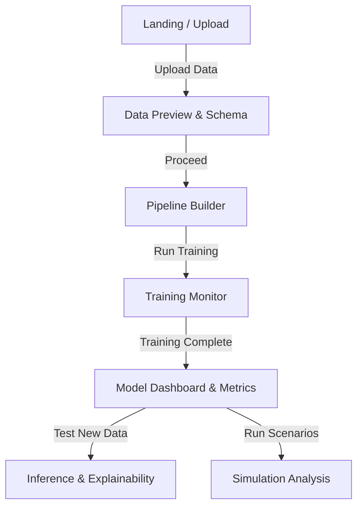

# GUI Storyboard: Prediction-Engine

This storyboard defines the user interface screens, layout structures, and navigation flow for the Prediction-Engine frontend. It focuses on functional components matching the backend services (preprocessing, training, inference, explainability, and simulation).

## Navigation Flow

---

## Screen 1: Landing & Data Upload
**Goal:** Allow users to easily ingest datasets (e.g., `synthetic_demo.csv`) and start a new project.

**Layout Structure:**
*   **Top Nav:** Project Logo, Link to Docs, User Settings
*   **Hero Section:** "Start a new Prediction Project"
*   **Main Card:** 
    *   Drag-and-drop zone
    *   Upload Button (calls `/api/upload` or backend `dataset_io.py`)
*   **Recent Projects List:** Quick links to previously trained models.

---

## Screen 2: Schema Preview & Type Detection
**Goal:** Verify data ingestion and automatically detected column types before preprocessing.

**Layout Structure:**
*   **Header:** Filename (e.g., `synthetic_demo.csv`) | Row Count | Column Count
*   **Data Table (Grid):**
    *   *Columns:* Feature Name | Detected Type (Categorical, Numeric, Text) | Missing Values % | Sample Data
    *   *Action:* Dropdown on each column to override type.
*   **Footer Actions:** "Back to Upload" | "Next: Configure Pipeline" (Primary)

---

## Screen 3: Preprocessing Pipeline Builder
**Goal:** Visually construct the `pipelines.py` steps.

**Layout Structure:**
*   **Left Sidebar (Component Palette):** 
    *   Imputation (Mean, Median, KNN)
    *   Scaling (Standard, MinMax)
    *   Outlier Removal (Z-Score, Isolation Forest)
*   **Center Canvas:** Interactive flow builder. User drags nodes from left and connects them.
    *   *Default nodes:* Raw Data -> Impute -> Scale -> Output.
*   **Right Sidebar (Node Config):** Shows settings for the currently selected node (e.g., if Z-Score is selected, slider for threshold).
*   **Top Right Actions:** "Save Pipeline" | "Start Training" 

---

## Screen 4: Training Monitor
**Goal:** Provide live feedback while `worker/tasks.py` and `tune_train.py` run in the background.

**Layout Structure:**
*   **Main View:**
    *   **Progress Bar:** 0 to 100% with current status text ("Optimizing hyperparameters", "Validating folds").
    *   **Terminal/Logs View (Collapsible):** Streaming output from backend.
    *   **Live Charts (Optional):** Loss curve updating in real-time.
*   **Action:** "Cancel Training"

---

## Screen 5: Inference & Explainability (SHAP & GraphRAG)
**Goal:** Make predictions on new inputs and understand *why* the model made that choice.

**Layout Structure:**
*   **Split View (50/50)**
*   **Left Pane (Input & Prediction):**
    *   Dynamic Form based on dataset schema.
    *   "Run Prediction" button.
    *   **Big Result Card:** Predicted Value / Class + Confidence Score.
*   **Right Pane (Explainability):**
    *   **Tabs:** [ SHAP Attributions ] | [ Knowledge Graph (GraphRAG) ]
    *   *SHAP Tab:* Horizontal bar chart showing top features driving the prediction up or down (`shap_explainer.py`).
    *   *GraphRAG Tab:* Interactive network graph highlighting related entities pulled from Neo4j/Weaviate databases.

---

## Screen 6: Advanced Simulation Engine
**Goal:** Run ABM (Agent-Based Models) or Markov attributions on macro/micro levels.

**Layout Structure:**
*   **Left Control Panel:** Sliders and inputs for simulation variables (e.g., Marketing spend, Population variables).
*   **Main Canvas:** 
    *   Time-series chart showing forecasted impact over time vs baseline.
    *   "Run Simulation" button triggering `abm_engine.py` or `engine_runner.py`.
*   **Bottom Pane:** Comparison table of Scenarios (Scenario A vs Scenario B).

---

## Component Ecosystem Requirements (Tailwind / Next.js)
To build this, the frontend team should prepare the following UI primitives:
1.  `<DataGrid />` with sorting and column typing.
2.  `<NodeFlowCanvas />` for the pipeline builder.
3.  `<ProgressBar />` and `<LogViewer />` for training.
4.  `<BarChart />` and `<NetworkGraph />` for explainability.
5.  `<Slider />` and `<TimeSeriesChart />` for simulations.